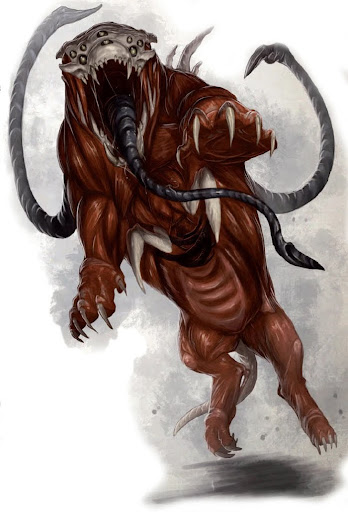

# Fafnir Nocturnus

## História

> Registro Imperial: V-992-Gilead
>
> Escriba: Cronista Imperial e Escriba Sênior da Dinastia Varonius
>
> Assunto: Hagiografia de Combate e Registro de Transumanismo Forçado

### O Nascimento em um Mundo Hostil

Fafnir não nasceu sob o sol, mas nas entranhas industriais do Mundo Forja Avachrus. Nascido prematuramente em uma colmeia sobrecarregada, seus pulmões se recusaram a aceitar o ar carregado de toxinas da superfície. Ele passou seus primeiros meses de vida trancado em uma incubadora mecânica primitiva, respirando através de filtros e respiradores artificiais, dependendo totalmente do espírito da máquina e de sua força de vontade para sobreviver. Esse início frágil marcou seu corpo com a palidez de quem nunca conheceu a luz natural. Fafnir desde o primeiro choro, aprendeu a lição fundamental de seu povo: sobreviver é a única liturgia que importa.

Sua infância foi uma sucessão de combates brutais contra o ambiente. Enquanto crianças de mundos civilizados aprendiam a ler, Fafnir aprendia a ignorar a fome e a tratar ferimentos infectados com a frieza de um autômato. Ele manifestou precocemente a característica de seu povo, **Sobrevivência Amarga**. No entanto, tamanha resiliência teve um preço social: a desvantagem **Não é dos Nossos**.

### O Herdeiro de Sangue

Aos dois anos, foi adotado por um casal de escribas do Administratum que, por décadas, haviam sido incapazes de gerar descendentes. Durante doze anos, Fafnir foi o centro de suas vidas, mas o destino do Imperium é cruel. O nascimento súbito de um filho biológico mudou tudo. Fafnir, antes um "filho", tornou-se um "fardo" e um "auxiliar". Enquanto o irmão biológico recebia o afeto, a Fafnir eram dadas as tarefas mais árduas, o rigor da disciplina imperial e a responsabilidade de cuidar de uma família que agora o via como um estranho.

### A Solidão e as Cicatrizes

A adolescência de Fafnir foi um abismo de isolamento. O sentimento de não ser suficiente o perseguia pelos corredores de metal. Em momentos de desespero, ele buscava o alívio na dor física, marcando sua própria pele — cicatrizes que ele escondia sob as vestes pesadas, mas que serviam como um lembrete silencioso de sua solidão. Mal sabia ele que essa dor era o combustível para algo latente em seu sangue: o Warp-touch.

### O Despertar das Chamas

Já adulto, Fafnir buscou preencher o vazio de sua alma com uma conexão humana, unindo-se a uma oficial da vigilância que representava tudo o que ele acreditava ser "correto". No entanto, a devoção dele foi respondida com a traição. Ao descobrir que fora enganado e usado, a dor emocional rompeu as barreiras de sua mente. O fogo que ele continha por dentro manifestou-se fisicamente pela primeira vez, transformando o local da descoberta em um inferno de chamas psíquicas. Fafnir foi denunciado e entregue aos agentes da Inquisição pelas mãos de quem ele mais confiava.

### O Caminho da Sanção

Fafnir não morreu nas mãos dos caçadores de bruxas. Ele foi acorrentado e levado em uma Nave Negra até a Scholastia Psykana, onde sobreviveu aos horrores de seus treinamentos. Lá, ele transformou sua dor em disciplina absoluta. Ele percebeu que o amor humano era volátil, mas a evolução espiritual e o controle sobre a energia do Imperador eram eternos.

Ele se dedicou obsessivamente ao estudo da Piromancia, aprendendo a esculpir o fogo que outrora o queimava, transformando-o na forma de um dragão ruginte que simboliza sua força ressurgida. Suas bionias magnéticas e sua armadura azul e vermelha são os símbolos de sua nova vida: um homem que não depende mais de pulmões frágeis ou de afetos traidores, mas do poder bruto da sua própria vontade.

Fafnir não é mais apenas um sobrevivente, ele é uma arma. Seu valor foi reconhecido pelos recrutadores da Dinastia Varonius. Nocturnus ascendeu como um Imperial Guard Officer veterano, mas seu verdadeiro lugar estava na elite da infantaria naval da frota. Ele tornou-se o portador da Varonia Honorbound pattern Shotgun, uma relíquia de curto alcance usada em abordagens violentas nos conveses de naves estelares. Sua lealdade a Jakel Varonius tornou-se o único pilar de sua existência em conformidade com a Lex Imperialis.

> REGISTRO DE SERVIÇO MILITAR: DINASTIA VARONIUS "O indivíduo Nocturnus, Fafnir, demonstra imunidade psicológica à fadiga. Sua eficácia com a Varonia Honorbound em operações de abordagem no Sub-setor N-4 garantiu a estabilidade da frota sob a Lex Imperialis. Lealdade absoluta confirmada sob juramento de sangue a Jakel Varonius."

Memória Significativa: O som do respirador da sua incubadora original, que ele agora associa ao ritmo do seu poder psíquico.

Grande Desejo: Provar para si mesmo (e para o espectro do seu passado) que ele é o recurso mais valioso do Sistema Gilead.

Habilidade Narrativa: Suas cicatrizes de adolescência brilham com uma luz azul quando ele conjura seus poderes, lembrando que sua dor foi o que o tornou poderoso.

Hoje, com 54 anos, Fafnir Nocturnus serve na Vanguarda de Varonius, um Psyker forjado na rejeição, mas temperado pelo fogo purificador. Ele não é apenas "suficiente": ele é a chama que ilumina a escuridão do 41º Milênio.

### Características iniciais

|Categoria|Dado/Atributo|Valor/Rating|
|:----------:|:----------:|:----------:|
|Identidade|Nome|Fafnir Nocturnus|
||Sexo|Masculino|
||Idade|54 anos|
||Altura|1,78m|
||Espécie|Humano|
||Facção|Adeptus Astra Telepathica|
||Arquétipo|32 - Sanctioned Psyker|
||Citação|Fafnir Nocturnus serve na Vanguarda de Varonius, um "mago" forjado na rejeição, mas temperado pelo fogo purificador.|
||Origem|Você tentou ignorar, suprimir ou esconder seu despertar psíquico, mas foi traído por aqueles mais próximos a você e se rendeu às Naves Negras.|
||Realização|Você resistiu ao chamado do Caos em um momento crucial, quando outros não conseguiram, e saiu ileso de um confronto com os Poderes da Ruína.|
||Objetivo|É preciso divulgar que nem todos os Psíquicos são bruxas ou feiticeiros — o objetivo é reverter os efeitos trágicos de séculos de propaganda.|
||Tier|2|
||Rank|1|
||Olhos|Cinza|
||Cabelo|Careca|
|Experiência|Total|200|
||Gasta|191|
||Atual|49|
|Atributos|Força (S)|1|
||Resistência (T)|3|
||Agilidade (A)|2|
||Iniciativa (I)|3|
||Vontade (Wil)|6|
||Intelecto (Int)|3|
||Companheirismo (Fel)|2|
|Perícias|Atletismo|1|
||Prontidão|3|
||Tiro|2|
||Manha|2|
||Dissimulação|4|
||Intuição|2|
||Intimidação|6|
||Investigação|3|
||Liderança|6|
||Medicina|3|
||Persuasão|2|
||Pilotagem|2|
||Mestria Psíquica|11|
||Erudição|4|
||Furtividade|2|
||Sobrevivência|6|
||Tecnologia|3|
||Luta|3|
|Combate|Defesa|2|
||Resiliência|4|
||Choque|8|
||Consciência Passiva|2|
||Furtividade|0|
||Velocidade|6|
||Flutuar|0|
|Lesões|Determinação|3|
||Ferimentos|7|
|Traços Mentais|Convicção|6|
||Resolução|6|
||Corrupção|0|
|Habilidades|Psyniscience|0XP DN:3|
||Deny The Witch|0XP DN:2+defesa psíquica do alvo|
||Smite|0XP DN:defesa do alvo, dano:1d3|
||Comjure Flame|10XP DN:4, dano:8+1ED, causa em chamas|
||Fiery Form|15XP DN:7,+1 defesa,imunidade a fogo e MELTA, dano:10+1ED|
||Molten Beam|20XP DN:defesa do alvo,dano:10+1ED,causa em chamas|
||Wall of Flame|15XP DN:7,dano:12+1ED alvos dentro da parede e 10+1ED alvos até 2 metros,causa em chamas|

## Primeira Ascensão

### O Embate contra a Abominação

O destino de Fafnir mudou permanentemente durante uma incursão. Frente a uma criatura, Fafnir enfrentou o ápice da fúria e o poder de uam abominação. No clímax do embate, a criatura desferiu um golpe devastador que resultou em uma **Ferida Memorável** catastrófica: sua mandíbula foi estilhaçada, reduzida a fragmentos de osso e carne pendente. Tecnicamente, Nocturnus falhou em seu teste inicial de **Resistência (T)** devido à magnitude do trauma, mas foi sua **Resiliência** de sobrevivente que lhe permitiu ignorar a agonia e o choque sistêmico, recusando-se a morrer e permitir que seus aliados costurassem seu rosto em uma tentativa desesperada de o salvar.

### Reconstrução sem Anestésicos

A dor era constante, falar e respirar eram batalhas diárias. A salvação veio através de Varonius, que cedeu um Respirador Augmético e
sob a supervisão de um Tecnosacerdote do Culto Mechanicus e um Boticário da frota, Nocturnus foi submetido a uma reconstrução cirúrgica visceral. A cirurgia de implante foi o seu maior teste. Ele exigiu que o procedimento fosse feito sem nenhum analgésico, pois se perdesse a consciência para escapar da dor, a **Disformidade** invadiria sua mente e o seria possuiria. Fafnir suportou horas de agonia indescritível com os olhos abertos, mantendo o controle do Warp apenas com pura **Força de Vontade (Will)**. O Tecnosacerdote não apenas costurou carne, mas calibrou os espíritos das máquinas dentro de sua musculatura traumatizada.

Hoje, o som rítmico do seu respirador é a sua âncora trazendo a mesma paz de quando ele era apenas um bebê na incubadora. Fafnir Nocturnus alcançou uma **Concentração Absoluta**, **Chamas** mais letais, **Imunidade à Dor**, **Campo de Força** inquebrável, maior **Fôlego** e **Resistência a Toxinas**.

### Características adquiridas

|Categoria|Dado/Atributo|Experiência necessária|Valor/Rating|Descrição|Observação|
|:----------:|:----------:|:----------:|:----------:|:----------:|:----------:|
|Saúde|Ferida Memorável|||Mandíbula|adquirida durante a batalha e essencial para ascensão|
|Pacote de Ascensão|Stay the Course|30|Tier 3, necessário ferida memorável|+1 de influência e 2 itens raros de até 6 de custo ou 1 item muito raro de mesmo valor|melhora a mecânica e narrativa do personagem|
|Atributos|Resistência (T)|25|+2 (total 5)|+defesa|mínimo 4 para Talento Feel no pain|
|Talentos|Feel no pain|40|mínimo 4 de Resistência (T)|Sem penalidade de ferimentos e +Rank no limite de ferimentos (wounds)|Importante para sobrevivência|
||Discipline Savant|30|mínimo 4 de Poder psíquico|-1 de dificuldade na conjuração das habilidades de fogo|aumenta chance de execução das habilidades de fogo|
|Itens|Foco psíquico|-|3 raro|+1 dado em testes de poder psíquico|maior poder destrutivo|
||Campo de força|-|5 raro|3AR invulnerabilidade (ignora AP)|maior resistência|
||Respirador augmético|-|5 raro|+1 dado de teste de resistência (T) para gases tóxicos, doenças ou venenos no ar|maior resistência e complementa a narrativa de concentração do personagem atrelado ao foco psíquico|

### Características após ascensão

|Categoria|Dado/Atributo|Valor/Rating|
|:----------:|:----------:|:----------:|
|Identidade|Nome|Fafnir Nocturnus|
||Tier|3|
||Rank|3|
|Experiência|Total|320|
||Gasta|316|
||Atual|4|
|Atributos|Força (S)|1|
||Resistência (T)|5|
||Agilidade (A)|2|
||Iniciativa (I)|3|
||Vontade (Wil)|6|
||Intelecto (Int)|3|
||Companheirismo (Fel)|2|
|Perícias|Atletismo|1|
||Prontidão|3|
||Tiro|2|
||Manha|2|
||Dissimulação|4|
||Intuição|2|
||Intimidação|6|
||Investigação|3|
||Liderança|6|
||Medicina|3|
||Persuasão|2|
||Pilotagem|2|
||Mestria Psíquica|11|
||Erudição|4|
||Furtividade|2|
||Sobrevivência|6|
||Tecnologia|3|
||Luta|3|
|Combate|Defesa|2|
||Resiliência|9|
||Choque|9|
||Consciência Passiva|2|
||Furtividade|0|
||Velocidade|6|
||Flutuar|0|
|Lesões|Determinação|5|
||Ferimentos|14|
|Traços Mentais|Convicção|6|
||Resolução|6|
||Corrupção|0|
|Habilidades|Psyniscience|0XP DN:3|
||Deny The Witch|0XP DN:2+defesa psíquica do alvo|
||Smite|0XP DN:defesa do alvo, dano:1d3|
||Comjure Flame|10XP DN:4-1, dano:8+1ED, causa em chamas|
||Fiery Form|15XP DN:7-1,+1 defesa,imunidade a fogo e MELTA, dano:10+1ED|
||Molten Beam|20XP DN:defesa do alvo-1,dano:10+1ED,causa em chamas|
||Wall of Flame|15XP DN:7-1,dano:12+1ED alvos dentro da parede e 10+1ED alvos até 2 metros,causa em chamas|
|Talentos|Feel no pain|40XP mínimo 4 de Resistência (T), Sem penalidade de ferimentos e +Rank no limite de ferimentos (wounds)|
||Discipline Savant|30XP mínimo 4 de Poder psíquico, -1 de dificuldade na conjuração das habilidades de fogo|
|Itens|Foco psíquico|+1 dado em testes de poder psíquico|
||Campo de força|3AR invulnerabilidade (ignora AP)|
||Respirador augmético|+1 dado de teste de resistência (T) para gases tóxicos, doenças ou venenos no ar|

## Próxima Ascensão

|Categoria|Dado/Atributo|Experiência necessária|Valor/Rating|Descrição|Observação|
|:----------:|:----------:|:----------:|:----------:|:----------:|:----------:|
|Atributos|Vontade (Wil)|55|+2 (total 8)|+poder de ataque|maoir poder destrutivo|
||Resistência (T)|75|+3 (total 8)|+defesa|maior resistência|
|Itens|Autodogmatic Cortex|-|6 muito raro|+1 Vontade (Wil)|maior poder destrutivo|
||Augmetic Viscera|-|5 muito raro|+1 Resistência (T)|maior resistência|
||Detecção por calor|-|6 raro|detecção de inimigos por calor|detecção do inimigo|
