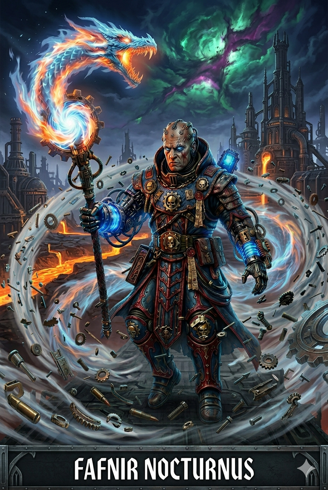

# Fafnir Nocturnus

## História

### A Origem: O Sopro de Ferro

Fafnir não nasceu sob o sol, mas nas entranhas industriais do Mundo Forja Avachrus. Nascido prematuramente em uma colmeia sobrecarregada, seus pulmões se recusaram a aceitar o ar carregado de toxinas da superfície. Ele passou seus primeiros meses de vida trancado em uma incubadora mecânica primitiva, respirando através de filtros e respiradores artificiais, dependendo totalmente do espírito da máquina para sobreviver. Esse início frágil marcou seu corpo com a palidez de quem nunca conheceu a luz natural.

### A Rejeição: O Herdeiro de Sangue

Aos dois anos, foi adotado por um casal de escribas do Administratum que, por décadas, haviam sido incapazes de gerar descendentes. Durante doze anos, Fafnir foi o centro de suas vidas, mas o destino do Imperium é cruel. O nascimento súbito de um filho biológico mudou tudo. Fafnir, antes um "filho", tornou-se um "fardo" e um "auxiliar". Enquanto o irmão biológico recebia o afeto, a Fafnir eram dadas as tarefas mais árduas, o rigor da disciplina imperial e a responsabilidade de cuidar de uma família que agora o via como um estranho.

### A Solidão e as Cicatrizes

A adolescência de Fafnir foi um abismo de isolamento. O sentimento de não ser suficiente o perseguia pelos corredores de metal. Em momentos de desespero, ele buscava o alívio na dor física, marcando sua própria pele — cicatrizes que ele escondia sob as vestes pesadas, mas que serviam como um lembrete silencioso de sua solidão. Mal sabia ele que essa dor era o combustível para algo latente em seu sangue: o Warp-touch.

### A Traição: O Despertar das Chamas

Já adulto, Fafnir buscou preencher o vazio de sua alma com uma conexão humana, unindo-se a uma oficial da vigilância que representava tudo o que ele acreditava ser "correto". No entanto, a devoção dele foi respondida com a traição. Ao descobrir que fora enganado e usado, a dor emocional rompeu as barreiras de sua mente. O fogo que ele continha por dentro manifestou-se fisicamente pela primeira vez, transformando o local da descoberta em um inferno de chamas psíquicas.

Fafnir foi denunciado e entregue aos agentes da Inquisição pelas mãos de quem ele mais confiava.

### A Evolução: O Caminho da Sanção

Fafnir não morreu nas mãos dos caçadores de bruxas. Ele foi acorrentado e levado em uma Nave Negra até Terra, onde sobreviveu aos horrores da Scholastia Psykana. Lá, ele transformou sua dor em disciplina absoluta. Ele percebeu que o amor humano era volátil, mas a evolução espiritual e o controle sobre a energia do Imperador eram eternos.

Ele se dedicou obsessivamente ao estudo da Piromancia, aprendendo a esculpir o fogo que outrora o queimava, transformando-o na forma de um dragão ruginte que simboliza sua força ressurgida. Suas bionias magnéticas e sua armadura azul e vermelha são os símbolos de sua nova vida: um homem que não depende mais de pulmões frágeis ou de afetos traidores, mas do poder bruto da sua própria vontade.

Memória Significativa: O som do respirador da sua incubadora original, que ele agora associa ao ritmo do seu poder psíquico.

Grande Desejo: Provar para si mesmo (e para o espectro do seu passado) que ele é o recurso mais valioso do Sistema Gilead.

Habilidade Narrativa: Suas cicatrizes de adolescência brilham com uma luz alaranjada quando ele conjura o poder Smite, lembrando que sua dor foi o que o tornou poderoso.

Hoje, com 54 anos, Fafnir Nocturnus serve na Vanguarda de Varonius, um "mago" forjado na rejeição, mas temperado pelo fogo purificador. Ele não é apenas "suficiente"; ele é a chama que ilumina a escuridão do 41º Milênio.

## Ficha inicial

|Categoria|Dado/Atributo|Valor/Rating|
|:----------:|:----------:|:----------:|
|Identidade|Nome|Fafnir Nocturnus|
||Sexo|Masculino|
||Idade|54 anos|
||Altura|1,78m|
||Espécie|Humano|
||Facção|Adeptus Astra Telepathica|
||Arquétipo|32 - Sanctioned Psyker|
||Citação|Fafnir Nocturnus serve na Vanguarda de Varonius, um "mago" forjado na rejeição, mas temperado pelo fogo purificador.|
||Origem|Você tentou ignorar, suprimir ou esconder seu despertar psíquico, mas foi traído por aqueles mais próximos a você e se rendeu às Naves Negras.|
||Realização|Você resistiu ao chamado do Caos em um momento crucial, quando outros não conseguiram, e saiu ileso de um confronto com os Poderes da Ruína.|
||Objetivo|É preciso divulgar que nem todos os Psíquicos são bruxas ou feiticeiros — o objetivo é reverter os efeitos trágicos de séculos de propaganda.|
||Tier|2|
||Rank|1|
||Olhos|Cinza|
||Cabelo|Careca|
|Experiência|Total|200|
||Gasta|191 (118)|
||Atual|49|
|Atributos|Força (S)|1|
||Resistência (T)|3|
||Agilidade (A)|2|
||Iniciativa (I)|3|
||Vontade (Wil)|6|
||Intelecto (Int)|3|
||Companheirismo (Fel)|2|
|Perícias|Mestria Psíquica|11|
||Intimidação|6|
||Liderança|6|
||Sobrevivência|6|
||Dissimulação|4|
||Erudição|4|
||Prontidão|3|
||Investigação|3|
||Medicina|3|
||Tecnologia|3|
||Luta|3|
||Tiro|2|
||Manha|2|
||Intuição|2|
||Persuasão|2|
||Pilotagem|2|
||Furtividade|2|
||Atletismo|1|
|Combate|Defesa|2|
||Resiliência|4|
||Choque|8|
||Consciência Passiva|2|
||Furtividade|0|
||Velocidade|6|
||Determinação|3|
||Ferimentos|7|
|Traços Mentais|Convicção|6|
||Resolução|6|
||Corrupção|0|
|Saúde|Ferida Memorável|Mandíbula|
|Habilidades|Psyniscience|0XP DN:3|
||Deny The Witch|0XP DN:2+defesa psíquica do alvo|
||Smite|0XP DN:defesa do alvo, dano:1d3|
||Comjure Flame|10XP DN:4, dano:8+1ED, causa em chamas|
||Fiery Form|15XP DN:7,+1 defesa,imunidade a fogo e MELTA, dano:10+1ED|
||Molten Beam|20XP DN:defesa do alvo,dano:10+1ED,causa em chamas|
||Wall of Flame|15XP DN:7,dano:12+1ED alvos dentro da parede e 10+1ED alvos até 2 metros,causa em chamas|

## Ascensão

|Categoria|Dado/Atributo|Experiência necessária|Valor/Rating|Descrição|Observação|
|:----------:|:----------:|:----------:|:----------:|:----------:|:----------:|
|Pacote de Ascensão|Stay the Course|30|Tier 3, necessário ferida memorável (já obtida)|+1 de influência e 2 itens raros de até 6 de custo ou 1 item muito raro de mesmo valor|melhora a mecânica e narrativa do personagem, visto que o mesmo já apresenta um ferimento memorável como requisito da ascenção|
|Atributos|Resistência (T)|25|+2 (total 5)|+defesa|mínimo 4 para Talento Feel no pain|
|Talentos|Feel no pain|40|mínimo 4 de Resistência (T)|Sem penalidade de ferimentos e +Rank no limite de ferimentos (wounds)|Importante para sobrevivência|
||Discipline Savant|30|mínimo 4 de Poder psíquico|-1 de dificuldade na conjuração das habilidades de fogo|aumenta chance de execução das habilidades de fogo|
|Itens|Foco psíquico|-|3 raro|+1 dado em testes de poder psíquico|maior poder destrutivo|
||Campo de força|-|5 raro|3AR invulnerabilidade (ignora AP)|maior resistência|
||Respirador aumentado|-|5 raro|+1 dado de teste de resistência (T) para gases tóxicos, doenças ou venenos no ar|maior resistência e complementa a narrativa de concentração do personagem atrelado ao foco psíquico|

### Próxima melhoria

|Categoria|Dado/Atributo|Experiência necessária|Valor/Rating|Descrição|Observação|
|:----------:|:----------:|:----------:|:----------:|:----------:|:----------:|
|Atributos|Vontade (Wil)|55|+2 (total 8)|+poder de ataque|maoir poder destrutivo|
|Talentos|Favoured by the Warp|40||permite rolar os dados de complicação uma vez|reduz efeitos colaterais das complicações da warp|
|Itens|Autodogmatic Cortex|-|6 muito raro|+1 Vontade (Wil)|maior poder destrutivo|
||Detecção por calor|-|6 raro|detecção de inimigos por calor|detecção do inimigo|
